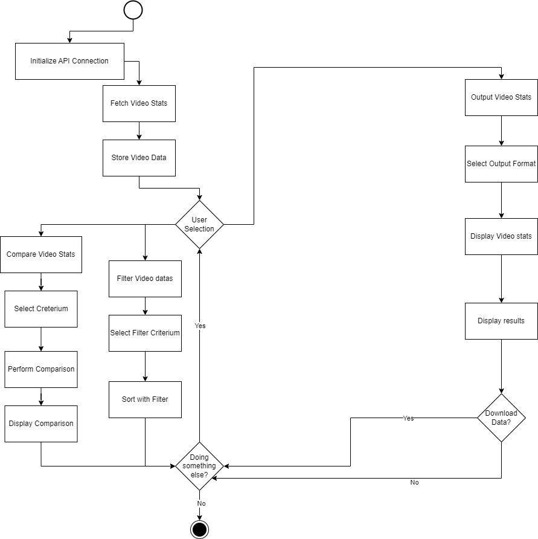

# Youtube Analyser
m122-Dataproject

Teilnehmer: Max

----------------

In dem Projekt geht es darum Daten von Youtube videos rauszulesen, zu analysieren und sie zu konvertieren.

Daraus ist es möglich Daten wie views, likes, kommentare, upload und noch vieles mehr zu filtern und zu vergleichen.

Das Projekt wird mit Python begleitet sowie der Youtube APIs.

----------------

wir wollen mit Remotedaten arbeiten, also werden die Daten auf einen Server geladen verarbeitet und dann wieder ausgegeben.

Die Umgebung wird mit Intellij, Python und FTP geführt und mit git dokumentiert.

Dazu wird uns ein AWS Amazon Server bereitgestellt.

UML Aktivitätsdiagram:
